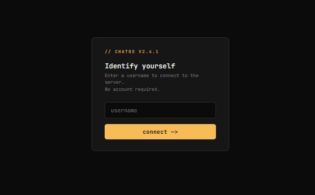
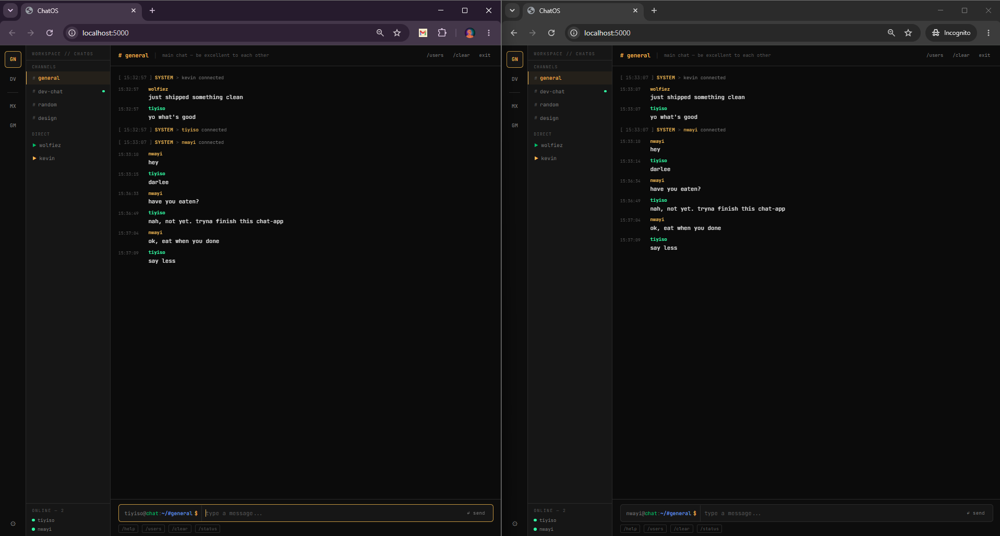

# ChatOS

<p align="center">
  <b>A terminal-inspired real-time chat application built with Node.js, Express, and Socket.IO.</b>
</p>

<p align="center">
  Modern • Real-Time • Developer Aesthetic • WebSockets
</p>

---

## Overview

**ChatOS** is a real-time chat application that combines the speed of **WebSockets** with a **terminal-inspired user experience**.

Instead of mimicking traditional messaging platforms, ChatOS embraces a developer-first aesthetic influenced by Linux terminals, modern IDEs, and cyberpunk-inspired interfaces while maintaining a clean and intuitive user experience.

Built using **Node.js**, **Express**, and **Socket.IO**, the application enables multiple users to communicate instantly across different chat channels.

---

# Screenshots

## Entry Point

Users are greeted with a terminal-inspired authentication screen where they identify themselves before joining the chat.

<p align="center">

</p>

---

## Real-Time Messaging

Once connected, users can communicate instantly with others through a modern terminal-style interface.

<p align="center">

</p>

---

# Features

*  Real-time communication using Socket.IO
*  Terminal-inspired interface
*  Modern dark cyberpunk aesthetic
*  Multi-user support
*  Instant message broadcasting
*  Multiple chat channels
*  Direct messages between users
*  Message reactions with quick emoji taps
*  Inline code and fenced code block rendering
*  `/theme` command with dark/light/dracula options
*  Live online users list
*  Terminal command-style input prompt
*  Animated boot sequence
*  Channel message history
*  Channel switching
*  Notification badge support
*  Responsive layout

---

# Tech Stack

* Node.js
* Express.js
* Socket.IO
* HTML5
* CSS3
* JavaScript

---

# Project Structure

```text
ChatOS
│
├── public
│   ├── app.js
│   ├── style.css
│   └── index.html
│
├── screenshots
│   ├── 1.png
│   └── 2.png
│
├── server.js
├── package.json
└── README.md
```

---

# Installation

Clone the repository:

```bash
git clone https://github.com/TiyisoWolfiez/Chat-App.git
```

Navigate into the project:

```bash
cd Chat-App
```

Install dependencies:

```bash
npm install
```

---

# Running the Application

Start the development server:

```bash
npm run dev
```

The application will be available at:

```text
http://localhost:5000
```

Open multiple browser tabs or windows to simulate multiple users chatting in real time.

# Deployment

For Railway deployment, this app works as a single service using SQLite. Railway can run the Express backend and keep the database file in service storage.

1. Create a Railway project.
2. Set the service port to `5000` or use the default Railway `PORT` environment variable.
3. Add a `DB_PATH` environment variable if you want to customize the SQLite file location (defaults to `./chatos.db`).
4. Deploy the repository and Railway will serve the backend and frontend together.

> Note: SQLite works best in Railway for low-traffic demos and simple persistence. For production, Railway Postgres is a stronger option.

---

# Design Philosophy

ChatOS is designed to feel like an operating system rather than a conventional messaging application.

Its design emphasizes:

* Developer-centric aesthetics
* Minimalism
* Monospace typography
* Terminal-inspired interactions
* Smooth animations
* Dark modern interface
* Real-time responsiveness

The goal is to create an experience that is both functional and memorable.

---

# Future Improvements

* Authentication system
* Persistent database storage
* Direct messaging
* Typing indicators
* Read receipts
* File sharing
* Emoji reactions
* Message search
* End-to-end encryption
* Docker support
* CI/CD pipeline
* Theme customization

---

# Getting Started for Contributors

Install dependencies:

```bash
npm install
```

Run the application:

```bash
npm run dev
```

If you encounter issues, ensure that all required packages have been installed:

```bash
npm install express socket.io
```

---

# Author

## Tiyiso Hlungwani

GitHub: https://github.com/TiyisoWolfiez

---

<p align="center">
Built with ☕, JavaScript, and WebSockets.
</p>
